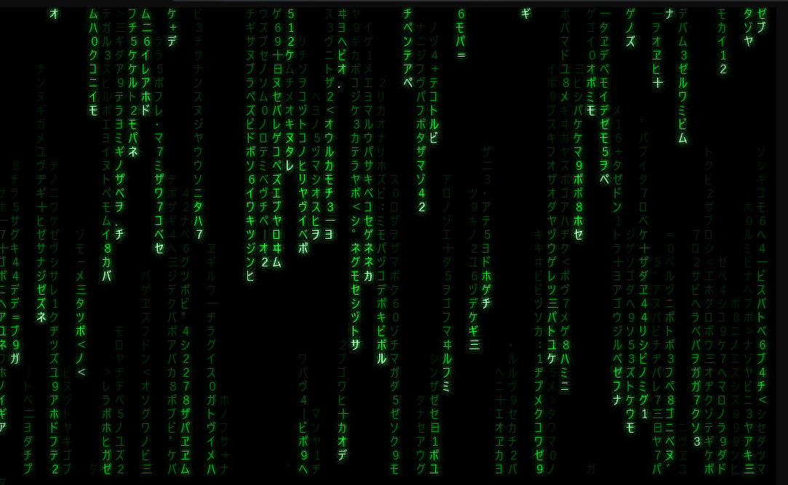

[](https://github.com/guitarrapc/matrix/actions/workflows/build.yaml)

# matrix

[English](README.md) | 日本語

ターミナルで動く緑のコードレインです。[Matrix のデジタルレイン](https://en.wikipedia.org/wiki/Digital_rain)をターミナルで流したくて作りました。

Windows、Linux、macOS で単体バイナリとして動きます。ASCII の雨、映画風の全角グリフ、True Color テーマ、Windows Terminal のピクセルシェーダーに対応しています。



| Shader | Shaderless (True-color) | ASCII |
| --- | --- | --- |
|  |  |  |

## Quick start

[GitHub Releases](https://github.com/guitarrapc/matrix/releases) から利用するOS向けのアセットをダウンロードし、`matrix`、Windowsでは `matrix.exe`、を `PATH` の通った場所に置いてください。

```sh
# Windows (Scoop)
scoop bucket add guitarrapc https://github.com/guitarrapc/scoop-bucket
scoop install matrix
```

```bash
# macOS/Linux では必要に応じて実行権限を付けます。
chmod +x ./matrix

# クラシックな Matrix rain を5秒間実行します。
matrix

# キーが押されるまで実行します。デフォルトの実行時間は5秒です。
matrix 0
matrix --duration 0

# ASCII グリフ、または映画風の全角グリフを使います。デフォルトは ascii です。
matrix --mode <ascii|movie>

# 組み込みのカラーパターンを選びます。
matrix --pattern <classic|resurrections|operator|twilight|rain|rainbow>

# カスタム色には #RGB、#RRGGBB、または16色の色名を指定できます。
# フォールバック順は hex True Color、近似16色パレット、色なし ASCII です。
matrix --bg "#080300" --head "#FFF3D0" --bright "#FF9F1A" --dim "#5A2100"

# フレームレートを変更します。FPSを上げると、実時間での雨の動きも速くなります。デフォルトは14です。
matrix --fps 10

# 1文字だけを繰り返し表示します。
matrix --char "λ"
```

**Usage**

```bash
matrix [duration]
matrix [--duration <seconds>] [--mode <ascii|movie>] [--char <character>]
       [--density <0.0-1.0>] [--fps <1-60>]
       [--pattern <classic|resurrections|operator|twilight|rain|rainbow>]
       [--bg <color>] [--head <color>] [--bright <color>] [--dim <color>]
       [--cursor-intensity <0.5-5.0>]
       [--help] [--version]
```

各オプションの正確な挙動、デフォルト値、検証範囲、ターミナル入出力、実装メモは [CLI specification](./.github/docs/spec_matrix.md) を参照してください。

### Shaders

ピクセルシェーダーに対応したターミナルでは、GPU シェーダーで描画済みの rain に発光やポストプロセスを追加できます。Bloom の強さは shader ファイル側で調整します。

Windows Terminal 向けのピクセルシェーダー例は `shaders/windows-terminal` にあります。

| Shader | Effect |
| --- | --- |
| `matrix-bloom.hlsl` | Matrix rain の先頭セル向けに調整した緑の bloom。 |
| `matrix-bloom-soft.hlsl` | より柔らかく広い bloom。 |
| `matrix-ripple.hlsl` | 画面全体へ広がる時限リップルと、強調された波頭。 |
| `verify-shader.hlsl` | 色反転の動作確認用。 |

Windows Terminal のプロファイルで `experimental.pixelShaderPath` を設定し、新しいタブを開いてからコマンドパレットで "Toggle shader effects" を実行してください。最小構成の設定例として `shaders/windows-terminal/config.example.json` を利用できます。

> [!TIP]
> [Windows Terminal の shader](https://github.com/microsoft/terminal/tree/main/samples/PixelShaders) 入力には、時刻、解像度、背景色、描画済みターミナルテクスチャが含まれます。マウスクリック座標は含まれないため、`matrix-ripple.hlsl` は固定された時限リップル起点を使います。

## Development

ローカル開発、デバッグ、publish には `dotnet` を使います。

### Requirements

- .NET 10 SDK (file-based C# app)

```bash
# Local run
dotnet run matrix.cs -- [args]
```
