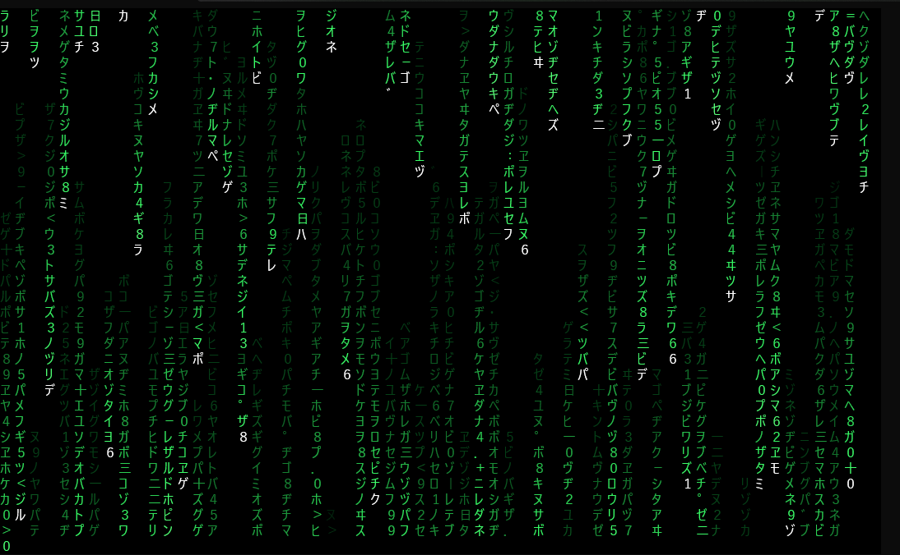
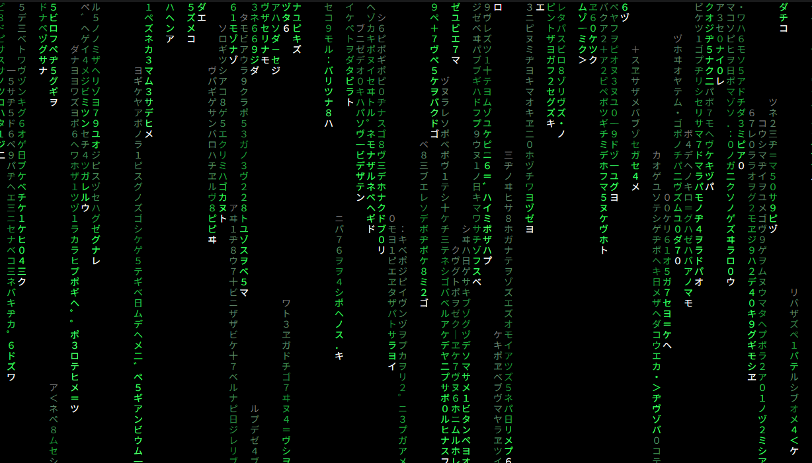

# matrix

Terminal-based green code rain.

| Shader | Shaderless (True-color) | ASCII |
| --- | --- | --- |
|  |  |  |

## Color patterns

Use `--pattern <name>` to choose a color preset:

| Pattern | Description |
| --- | --- |
| `classic` | Default original trilogy-style green rain. |
| `resurrections` | Yellow-green Resurrections-style rain. |
| `operator` | Classic green without a dim trail color. |
| `twilight` | Deep-blue background with hot-pink rain and yellow heads. |
| `rain` | Blue-cyan rain on a dark rainy-night background. |
| `rainbow` | Seven vertical color bands from left to right: red, orange, yellow, green, blue, indigo, violet. |

`--bg`, `--head`, `--bright`, and `--dim` override preset colors. For `rainbow`, only `--bg` is used because the rain colors come from the seven-band palette.

## Windows Terminal shaders

Example shaders live in `shaders/windows-terminal`:

| Shader | Effect |
| --- | --- |
| `matrix-bloom.hlsl` | Green bloom tuned for the Matrix rain head cells. |
| `matrix-bloom-soft.hlsl` | Softer, wider bloom. |
| `matrix-ripple.hlsl` | A large timed ripple that expands across the whole screen with highlighted wave crests. |
| `verify-shader.hlsl` | Color inversion sanity check. |

Set `experimental.pixelShaderPath` in a Windows Terminal profile, open a new tab,
then run "Toggle shader effects" from the command palette. Use
`shaders/windows-terminal/config.example.json` as a minimal settings example.

Windows Terminal's shader inputs include time, resolution, background color, and
the rendered terminal texture. They do not include mouse click coordinates, so
`matrix-ripple.hlsl` uses fixed timed ripple origins rather than a true
click-origin ripple.
